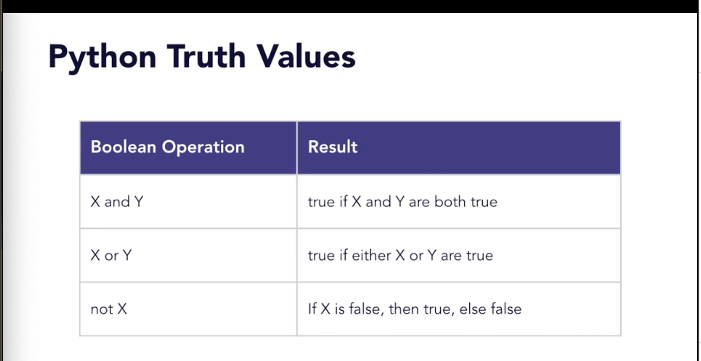

# Language

## Truth Value Testing

Any object can be tested for Boolean truth value. Every object returns true unless False and NOne evaluate to false. These are Numeric zero values `0, 0.0, 0j`; `Decimal(0)`, `Fraction(0, x)`; Empty sequences/collections: `'', (),[],{}`; Empty sets and ranges: `set(), range(0)`.

Classes return true unles overridden with a revalue of `False` or `0`.

## Strings

[Template Strings](https://docs.python.org/3/library/string.html)