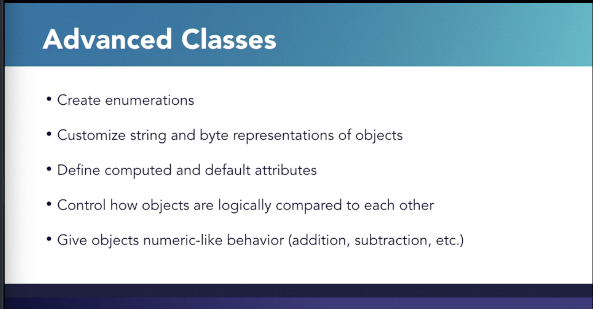
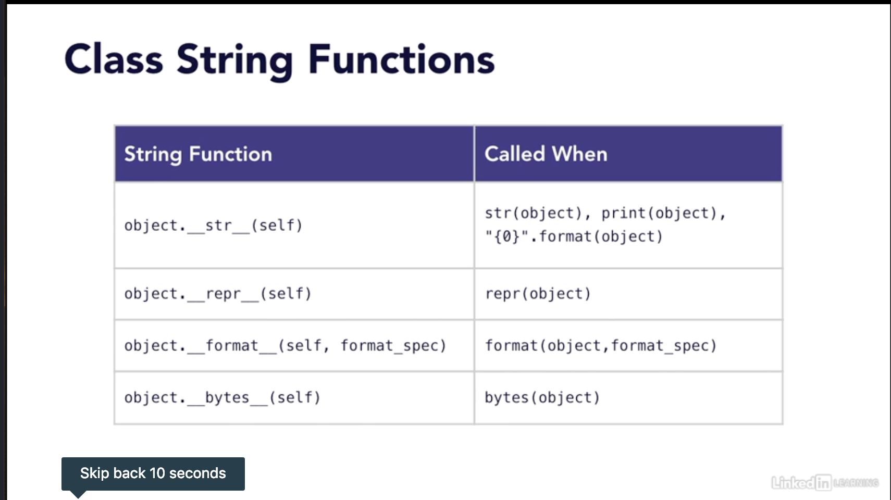
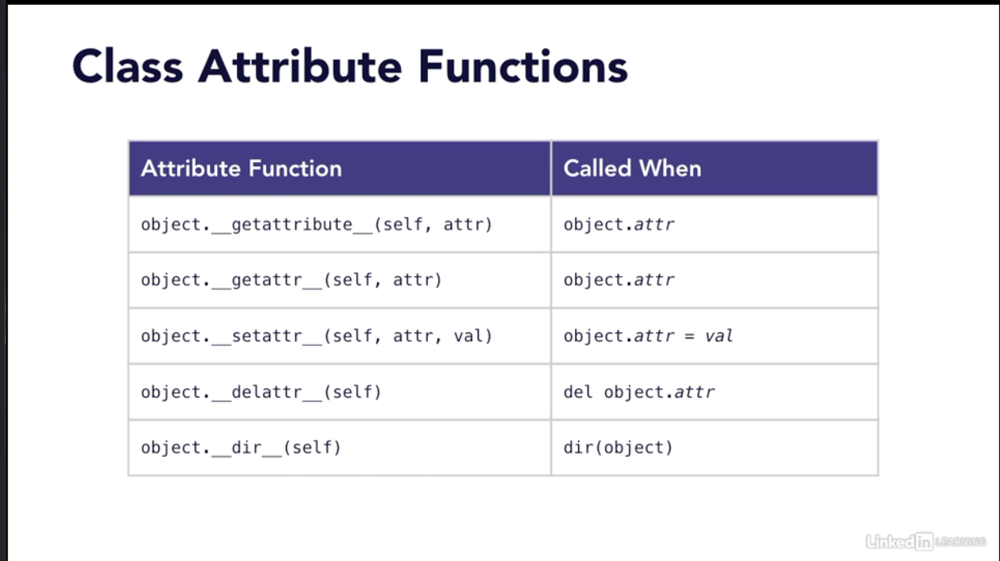
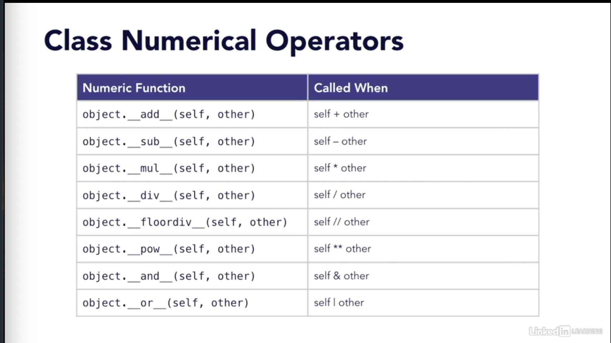
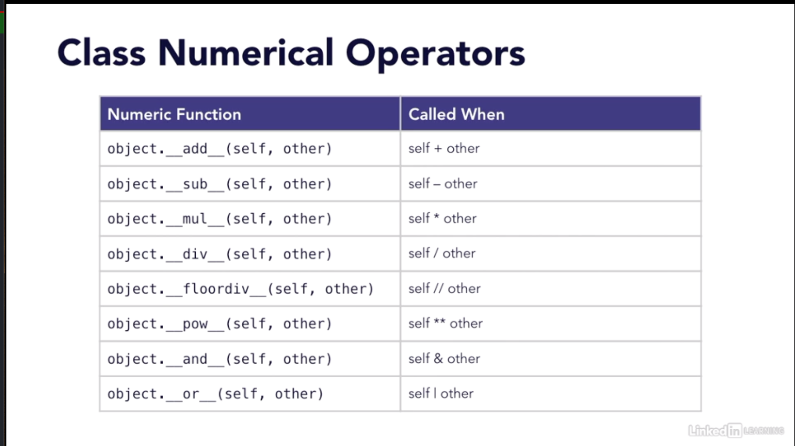
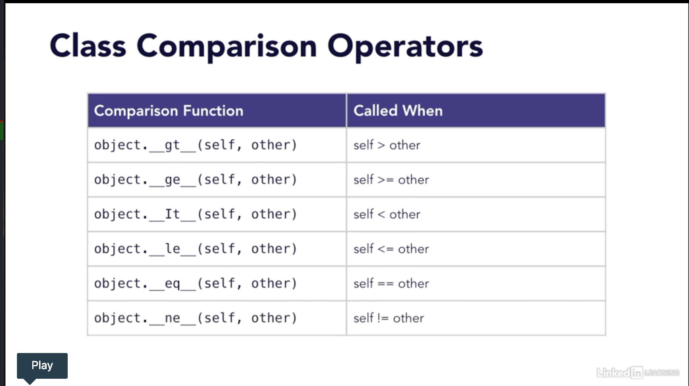

# Advanced Classes and Objects

## Enumerations

## Class String Values

## Attribute Functions

## Numerical Operators

### In place math operators

look at data model chapter in docs for more on the list.

## Comparison Operators

