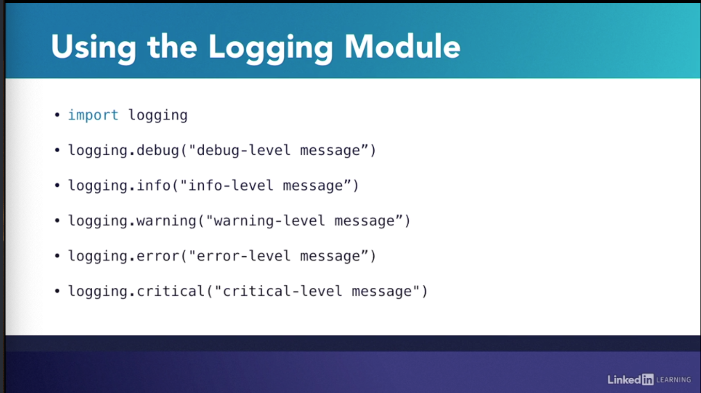
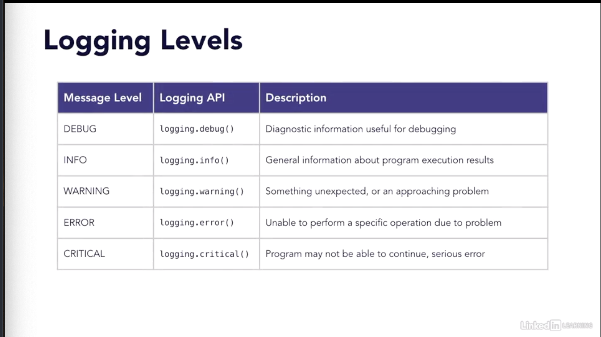
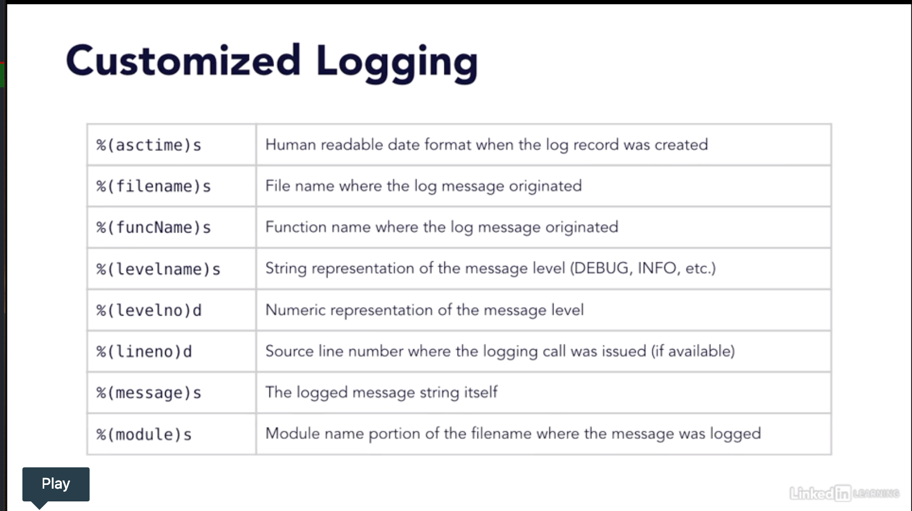

# Logging

1.Captures and records events while app is running
2.Useful debugging feature. No always practical to debut in real time.
3. Events can be categorized for easier analysis
4. Provides transaction record of a progrm's execution
5. Highly customizable

## Using

These are different levels of errors

## Logging levels

configurable using logging.basicConfig(level=logging.DEBUG)

## customized logging

