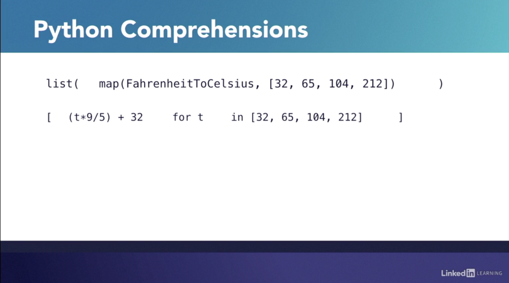

# Comprehensions

Python construct that can be applied to `[]`, `{1,2,3}`, `{a:'a'}`. Using a map funciton, it takes a funciton as a paramater. We can use an output expression and use a loop and wrap the whole construct in braces.

Limit to two expressions in a comprehension as it will become a wielding.